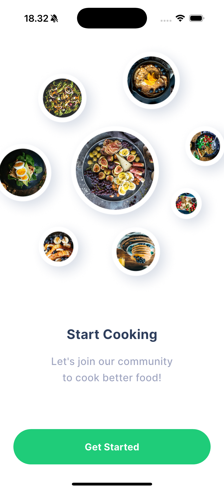
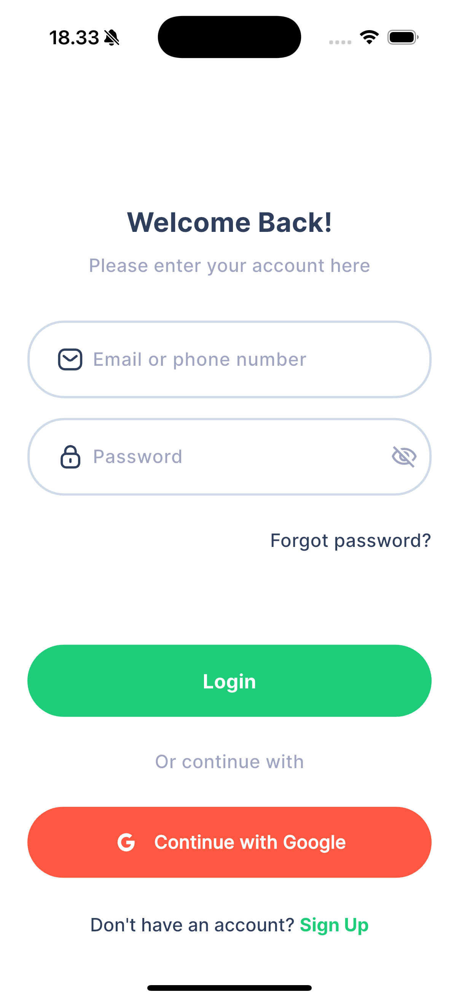
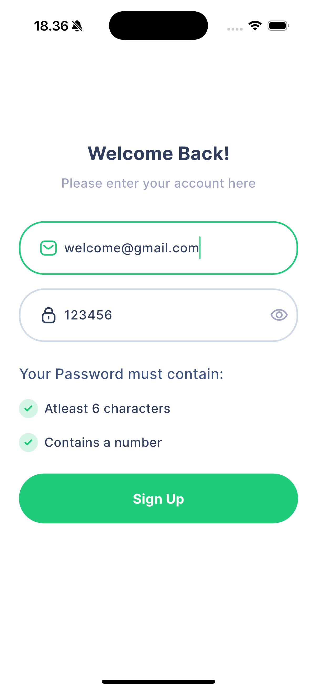

# Recipe App

Aplikasi resep makanan yang dibuat dengan Flutter. Proyek ini adalah latihan untuk mengimplementasikan slicing UI dari desain yang ada di Figma.

## Status Proyek

**⚠️ Peringatan: Proyek ini masih dalam tahap pengembangan.**

Harap dicatat bahwa aplikasi ini adalah sebuah latihan dan masih dalam proses pengerjaan. Beberapa fitur mungkin belum diimplementasikan atau belum berfungsi dengan sempurna.

## Screenshot

| Onboarding Page | Sign-In Page | Sign-Up Page |
| :-------------: | :----------: | :----------: |
|  |  |  |

## Sumber Desain

Desain UI untuk aplikasi ini dibuat di Figma dan dapat diakses melalui link berikut:

- **[Recipe App Design on Figma](https://www.uistore.design/items/chefio-recipe-free-app-ui-kit-for-figma/)**

Terima kasih kepada desainer atas desainnya yang keren!
